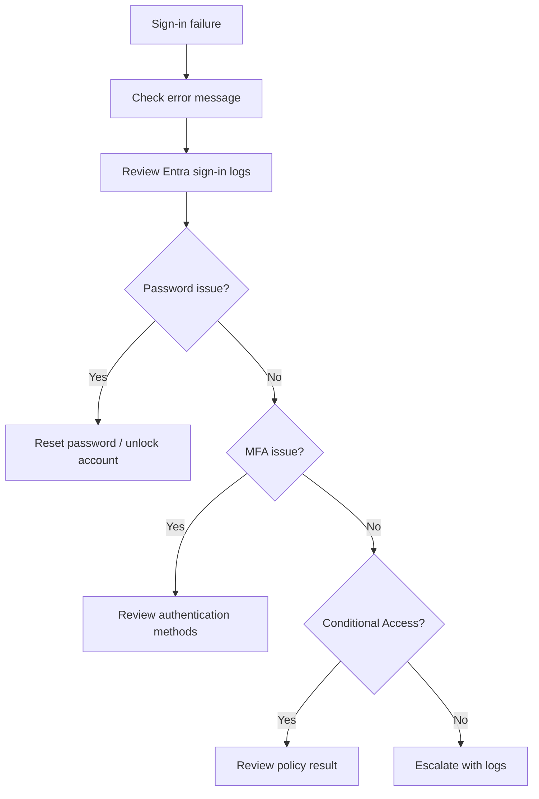

# Entra ID Sign-in Troubleshooting Flow

```mermaid
flowchart TD
    A[Sign-in failure] --> B[Check error message]
    B --> C[Review Entra sign-in logs]
    C --> D{Password issue?}
    D -- Yes --> E[Reset password / unlock account]
    D -- No --> F{MFA issue?}
    F -- Yes --> G[Review authentication methods]
    F -- No --> H{Conditional Access?}
    H -- Yes --> I[Review policy result]
    H -- No --> J[Escalate with logs]
```
