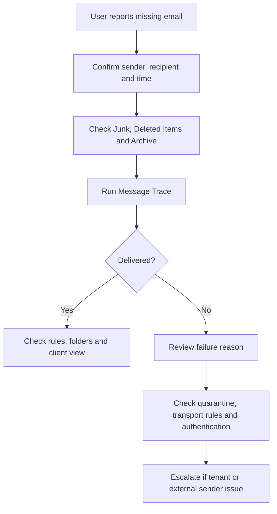

# Mail Flow Investigation Flow

```mermaid
flowchart TD
A[User reports missing email] --> B[Confirm sender, recipient and time]
B --> C[Check Junk, Deleted Items and Archive]
C --> D[Run Message Trace]
D --> E{Delivered?}
E -- Yes --> F[Check rules, folders and client view]
E -- No --> G[Review failure reason]
G --> H[Check quarantine, transport rules and authentication]
H --> I[Escalate if tenant or external sender issue]
```

[Back to Diagrams](./README.md)
