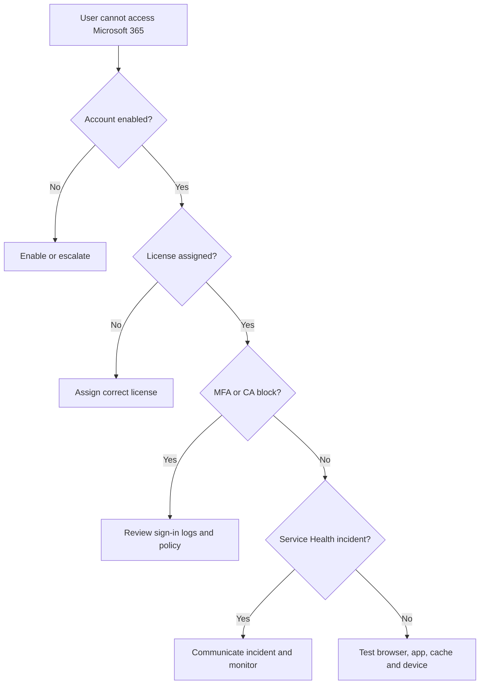

# Microsoft 365 Access Troubleshooting Flow

```mermaid
flowchart TD
    A[User cannot access Microsoft 365] --> B{Account enabled?}
    B -- No --> C[Enable or escalate]
    B -- Yes --> D{License assigned?}
    D -- No --> E[Assign correct license]
    D -- Yes --> F{MFA or CA block?}
    F -- Yes --> G[Review sign-in logs and policy]
    F -- No --> H{Service Health incident?}
    H -- Yes --> I[Communicate incident and monitor]
    H -- No --> J[Test browser, app, cache and device]
```
