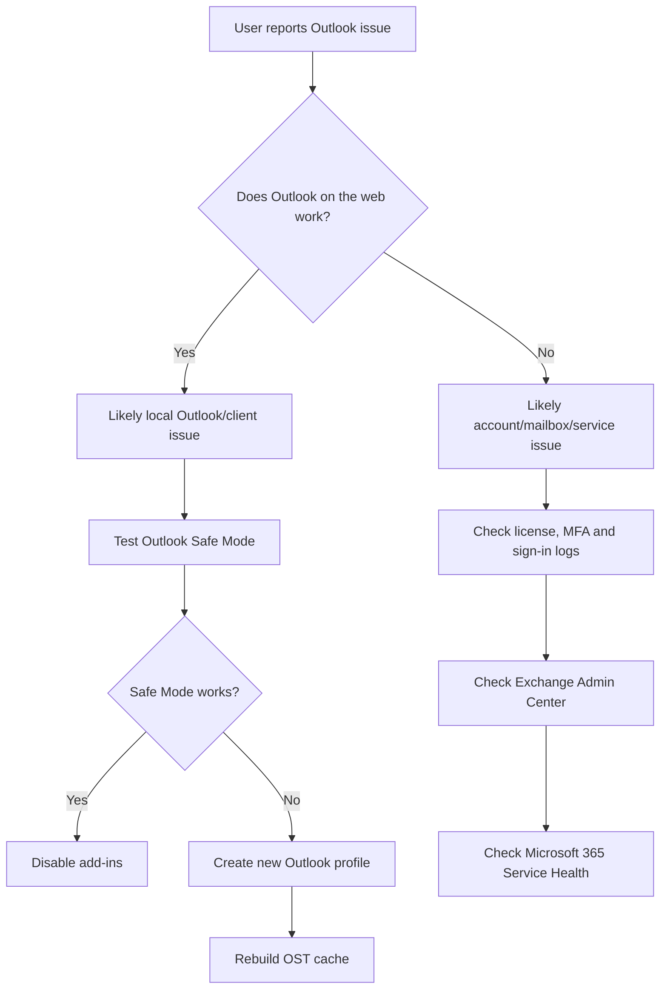

# Outlook Troubleshooting Flow

```mermaid
flowchart TD
A[User reports Outlook issue] --> B{Does Outlook on the web work?}
B -- Yes --> C[Likely local Outlook/client issue]
B -- No --> D[Likely account/mailbox/service issue]
C --> E[Test Outlook Safe Mode]
E --> F{Safe Mode works?}
F -- Yes --> G[Disable add-ins]
F -- No --> H[Create new Outlook profile]
H --> I[Rebuild OST cache]
D --> J[Check license, MFA and sign-in logs]
J --> K[Check Exchange Admin Center]
K --> L[Check Microsoft 365 Service Health]
```

[Back to Diagrams](./README.md)
