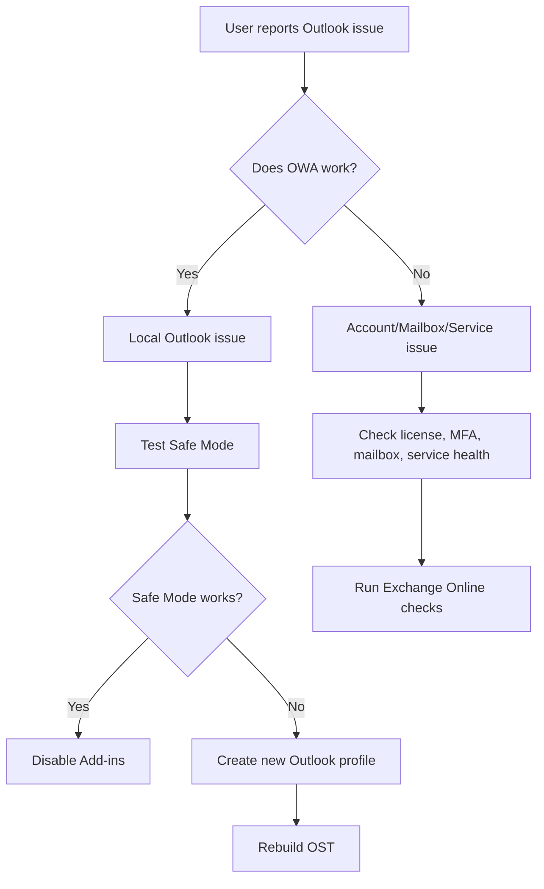

# Outlook Troubleshooting Flow

```mermaid
flowchart TD
    A[User reports Outlook issue] --> B{Does OWA work?}
    B -- Yes --> C[Local Outlook issue]
    B -- No --> D[Account/Mailbox/Service issue]
    C --> E[Test Safe Mode]
    E --> F{Safe Mode works?}
    F -- Yes --> G[Disable Add-ins]
    F -- No --> H[Create new Outlook profile]
    H --> I[Rebuild OST]
    D --> J[Check license, MFA, mailbox, service health]
    J --> K[Run Exchange Online checks]
```

[⬅ Back to Main README](../README.md)
