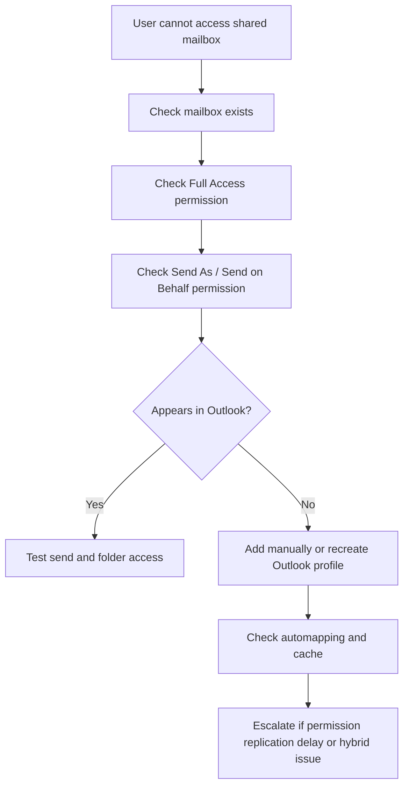

# Shared Mailbox Access Flow

```mermaid
flowchart TD
A[User cannot access shared mailbox] --> B[Check mailbox exists]
B --> C[Check Full Access permission]
C --> D[Check Send As / Send on Behalf permission]
D --> E{Appears in Outlook?}
E -- Yes --> F[Test send and folder access]
E -- No --> G[Add manually or recreate Outlook profile]
G --> H[Check automapping and cache]
H --> I[Escalate if permission replication delay or hybrid issue]
```

[Back to Diagrams](./README.md)
