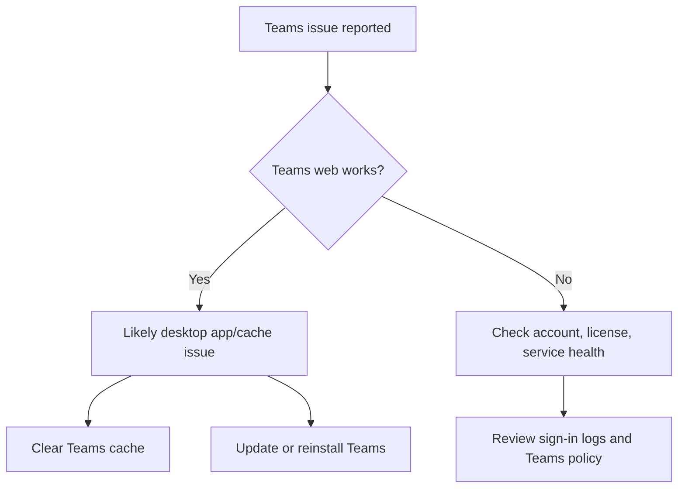

# Teams Troubleshooting Flow

```mermaid
flowchart TD
    A[Teams issue reported] --> B{Teams web works?}
    B -- Yes --> C[Likely desktop app/cache issue]
    B -- No --> D[Check account, license, service health]
    C --> E[Clear Teams cache]
    C --> F[Update or reinstall Teams]
    D --> G[Review sign-in logs and Teams policy]
```
