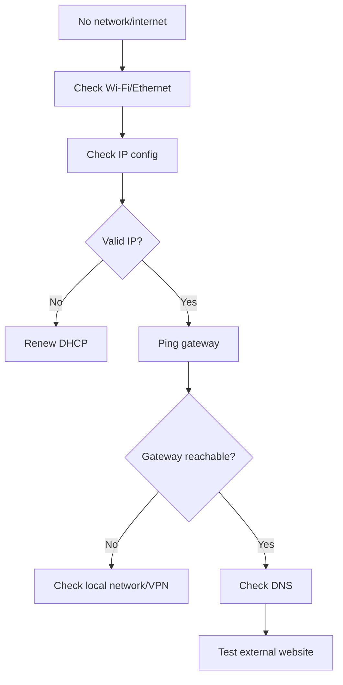

# Windows Network Troubleshooting Flow

```mermaid
flowchart TD
    A[No network/internet] --> B[Check Wi-Fi/Ethernet]
    B --> C[Check IP config]
    C --> D{Valid IP?}
    D -- No --> E[Renew DHCP]
    D -- Yes --> F[Ping gateway]
    F --> G{Gateway reachable?}
    G -- No --> H[Check local network/VPN]
    G -- Yes --> I[Check DNS]
    I --> J[Test external website]
```
